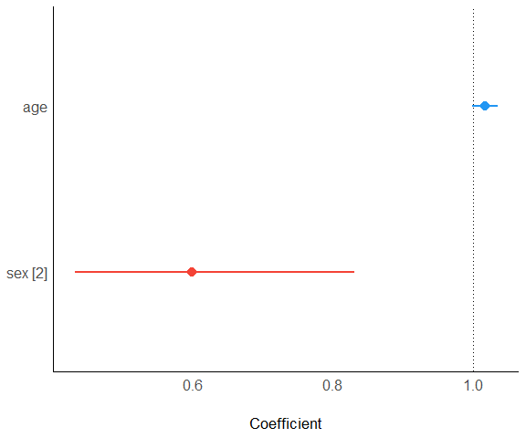
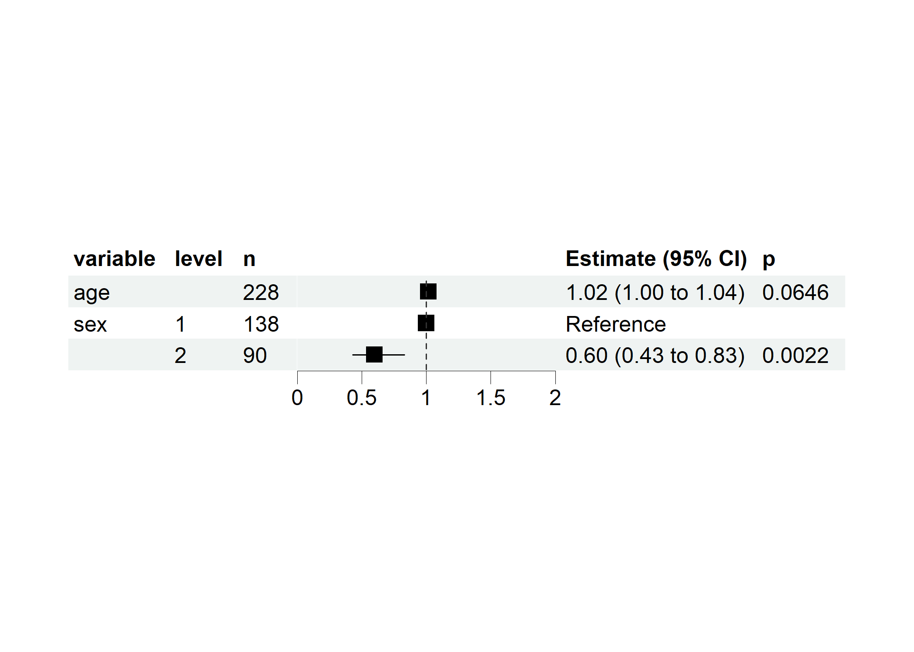
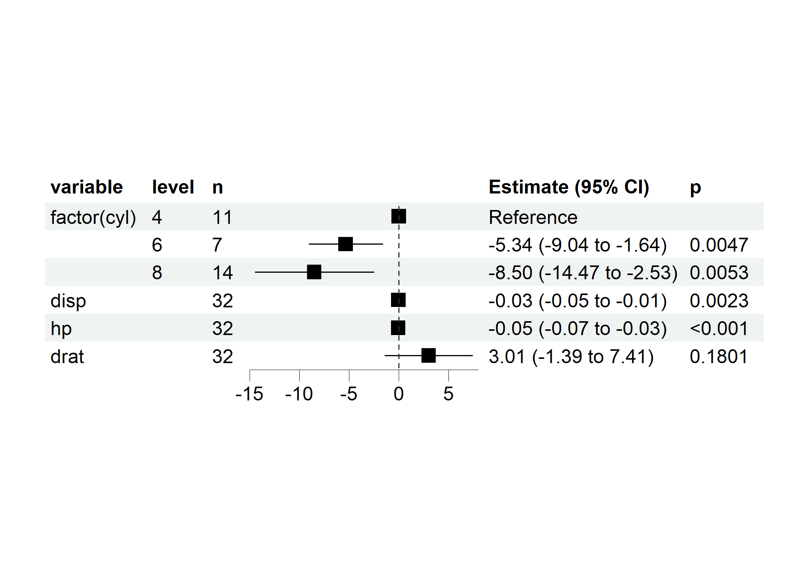

<!-- README.md is generated from README.Rmd. Please edit that file -->

# regport

<!-- badges: start -->

[](https://cran.r-project.org/package=regport)
[](https://lifecycle.r-lib.org/articles/stages.html)
[](https://github.com/ShixiangWang/regport/actions)
[](https://cran.r-project.org/package=regport)
[](https://github.com/ShixiangWang/regport/issues?q=is%3Aissue+is%3Aclosed)
[](https://github.com/ShixiangWang/regport)
[](https://hits.seeyoufarm.com)

<!-- badges: end -->

The goal of regport is to provides R6 classes, methods and utilities to
construct, analyze, summarize, and visualize regression models (CoxPH
and GLMs).

## Installation

You can install the development version of regport like so:

``` r
remotes::install_github("ShixiangWang/regport")
```

## Simple case

This is a basic example which shows you how to build and visualize a Cox
model.

Prepare data:

``` r
library(regport)
library(survival)

lung = survival::lung
lung$sex = factor(lung$sex)
```

Create a model:

``` r
model = REGModel$new(
  lung,
  recipe = list(
    x = c("age", "sex"),
    y = c("time", "status")
  )
)
#> data.frame [228, 3]
#> survival::Surv(time, status) Surv 306 455 1010 210 883 1022~
#> age                          dbl  74 68 56 57 60 74
#> sex                          fct  1 1 1 1 1 1

model
#> <REGModel>    ========== 
#> 
#> Parameter | Coefficient |       SE |       95% CI |     z |     p
#> -----------------------------------------------------------------
#> age       |        1.02 | 9.38e-03 | [1.00, 1.04] |  1.85 | 0.065
#> sex [2]   |        0.60 |     0.10 | [0.43, 0.83] | -3.06 | 0.002
#> 
#> Uncertainty intervals (equal-tailed) and p values (two-tailed) computed using a
#>   Wald z-distribution approximation.
#> [coxph] model ==========
```

You can also create it with formula:

``` r
model = REGModel$new(
  lung,
  recipe = Surv(time, status) ~ age + sex
)
#> data.frame [228, 3]
#> Surv(time, status) Surv 306 455 1010 210 883 1022 1 1 0 1 1~
#> age                dbl  74 68 56 57 60 74
#> sex                fct  1 1 1 1 1 1

model
#> <REGModel>    ========== 
#> 
#> Parameter | Coefficient |       SE |       95% CI |     z |     p
#> -----------------------------------------------------------------
#> age       |        1.02 | 9.38e-03 | [1.00, 1.04] |  1.85 | 0.065
#> sex [2]   |        0.60 |     0.10 | [0.43, 0.83] | -3.06 | 0.002
#> 
#> Uncertainty intervals (equal-tailed) and p values (two-tailed) computed using a
#>   Wald z-distribution approximation.
#> [coxph] model ==========
```

Visualize it:

``` r
model$plot()
```



Visualize with more nice forest plot.

``` r
model$get_forest_data()
model$plot_forest()
```



## Batch processing models

``` r
ml <- REGModelList$new(
  data = mtcars,
  y = "mpg",
  x = c("factor(cyl)", colnames(mtcars)[3:5]),
  covars = c(colnames(mtcars)[8:9], "factor(gear)")
)
ml
#> <REGModelList>    ========== 
#> 
#> X(s): factor(cyl), disp, hp, drat 
#> Y(s): mpg 
#> covars: vs, am, factor(gear) 
#> 
#> Not build yet, run $build() method 
#> [] model ==========
ml$build(f = "gaussian")
#> data.frame [32, 5]
#> mpg          dbl 21 21 22.8 21.4 18.7 18.1
#> factor(cyl)  fct 6 6 4 6 8 6
#> vs           dbl 0 0 1 1 0 1
#> am           dbl 1 1 1 0 0 0
#> factor(gear) fct 4 4 4 3 3 3
#> data.frame [32, 5]
#> mpg          dbl 21 21 22.8 21.4 18.7 18.1
#> disp         dbl 160 160 108 258 360 225
#> vs           dbl 0 0 1 1 0 1
#> am           dbl 1 1 1 0 0 0
#> factor(gear) fct 4 4 4 3 3 3
#> data.frame [32, 5]
#> mpg          dbl 21 21 22.8 21.4 18.7 18.1
#> hp           dbl 110 110 93 110 175 105
#> vs           dbl 0 0 1 1 0 1
#> am           dbl 1 1 1 0 0 0
#> factor(gear) fct 4 4 4 3 3 3
#> data.frame [32, 5]
#> mpg          dbl 21 21 22.8 21.4 18.7 18.1
#> drat         dbl 3.9 3.9 3.85 3.08 3.15 2.76
#> vs           dbl 0 0 1 1 0 1
#> am           dbl 1 1 1 0 0 0
#> factor(gear) fct 4 4 4 3 3 3
str(ml$result)
#> Classes 'data.table' and 'data.frame':   25 obs. of  10 variables:
#>  $ focal_term: chr  "factor(cyl)" "factor(cyl)" "factor(cyl)" "factor(cyl)" ...
#>  $ variable  : chr  "(Intercept)" "factor(cyl)6" "factor(cyl)8" "vs" ...
#>  $ estimate  : num  23.28 -5.34 -8.5 1.68 4.31 ...
#>  $ SE        : num  3.1 1.89 3.05 2.35 2.16 ...
#>  $ CI        : num  0.95 0.95 0.95 0.95 0.95 0.95 0.95 0.95 0.95 0.95 ...
#>  $ CI_low    : num  17.203 -9.04 -14.473 -2.931 0.084 ...
#>  $ CI_high   : num  29.37 -1.64 -2.53 6.3 8.54 ...
#>  $ t         : num  7.504 -2.829 -2.791 0.715 1.999 ...
#>  $ df_error  : int  25 25 25 25 25 25 25 26 26 26 ...
#>  $ p         : num  6.18e-14 4.67e-03 5.25e-03 4.75e-01 4.56e-02 ...
#>  - attr(*, ".internal.selfref")=<externalptr>
str(ml$forest_data)
#> Classes 'data.table' and 'data.frame':   6 obs. of  17 variables:
#>  $ focal_term: chr  "factor(cyl)" "factor(cyl)" "factor(cyl)" "disp" ...
#>  $ variable  : chr  "factor(cyl)" NA NA "disp" ...
#>  $ term      : chr  "factor(cyl)4" "factor(cyl)6" "factor(cyl)8" "disp" ...
#>  $ term_label: chr  "factor(cyl)" "factor(cyl)" "factor(cyl)" "disp" ...
#>  $ class     : chr  "factor" "factor" "factor" "numeric" ...
#>  $ level     : chr  "4" "6" "8" NA ...
#>  $ level_no  : int  1 2 3 NA NA NA
#>  $ n         : int  11 7 14 32 32 32
#>  $ estimate  : num  0 -5.3404 -8.5026 -0.0282 -0.0515 ...
#>  $ SE        : num  NA 1.88767 3.04626 0.00924 0.01201 ...
#>  $ CI        : num  NA 0.95 0.95 0.95 0.95 0.95
#>  $ CI_low    : num  NA -9.0402 -14.4732 -0.0463 -0.075 ...
#>  $ CI_high   : num  NA -1.6407 -2.532 -0.0101 -0.0279 ...
#>  $ t         : num  NA -2.83 -2.79 -3.05 -4.28 ...
#>  $ df_error  : int  NA 25 25 26 26 26
#>  $ p         : num  NA 4.67e-03 5.25e-03 2.27e-03 1.84e-05 ...
#>  $ reference : logi  TRUE FALSE FALSE FALSE FALSE FALSE
#>  - attr(*, ".internal.selfref")=<externalptr>

ml$plot_forest(ref_line = 0, xlim = c(-15, 8))
```



## Coverage

``` r
covr::package_coverage()
#> regport Coverage: 83.27%
#> R/utils.R: 75.00%
#> R/REGModelList.R: 79.31%
#> R/REGModel.R: 85.14%
```

## LICENSE

(MIT) Copyright (c) 2022 Shixiang Wang
